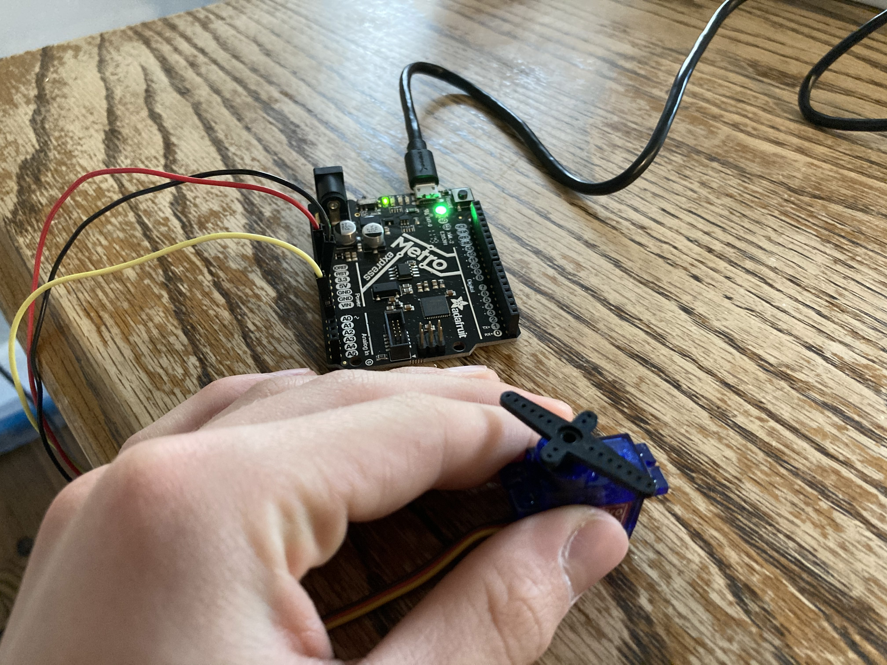

# CircuitPython

## Table of Contents
* [Table of Contents](#TableOfContents)
* [Hello_CircuitPython](#Hello_CircuitPython)
* [CircuitPython_Servo](#CircuitPython_Servo)
* [CircuitPython_LCD](#CircuitPython_LCD)
---

## Hello_CircuitPython

### Description:
Hello CircuitPython was an assignment where you setup your Metroid Express along with a code-editing software and your Mac/Chromebook/PC at home. First, [watch the video](https://cvilleschools.instructure.com/courses/31071/assignments/258611?module_item_id=797166) on the assignment. I am using my school Chromebook at home, so I had to install CARET and BEAGLE TERM as my software for editing code/serial monitor. Below is the commented code I used for this assignment.

### Commented Code:
``` python
import board
import neopixel

dot = neopixel.NeoPixel(board.NEOPIXEL, 1)

print("Make it red!")           # Makes the serial monitor say "Make it red!" when the LED is red.
while True:                  # While True is basically the Loop command in Arduino.
dot.fill((255,0,0))     #This command makes the neopixel LED on the Metroid light up red.
```
### Picture:


### Reflection:
For this assignment I learned how to make the neopixel LED light up as a color. The code for this is part of my commented code. The neopixel works with RGB values, so if you want to make it light up a specific color, find the RGB values of that color using Google and then input them into the command:
``` python
dot.fill((0,0,0))
```
For example, if I want my neopixel to light up as cyan, I can search Google to find the RGB values of that color (0,255,255). Then just input those values into your command:
``` python
 dot.fill((0,255,255))
```

## CircuitPython_Servo

[source of code](https://learn.adafruit.com/circuitpython-essentials/circuitpython-servo)

### Description & Code
For this assignment we were required to make a servo sweep back and forth from 0 to 180 degrees.

```python
import time
import board
import pulseio
from adafruit_motor import servo
 
# create a PWMOut object on Pin A2.
pwm = pulseio.PWMOut(board.A2, duty_cycle=2 ** 15, frequency=50)
 
# Create a servo object, my_servo.
my_servo = servo.Servo(pwm)
 
while True:
    for angle in range(0, 180, 20):  # 0 - 180 degrees, 20 degrees at a time.
        my_servo.angle = angle
        time.sleep(0.05)
    for angle in range(180, 0, -5): # 180 - 0 degrees, 5 degrees at a time.
        my_servo.angle = angle
        time.sleep(0.05)
```

### Images

### Reflection


## CircuitPython_LCD

### Description & Code

```python
Code goes here

```

### Evidence

### Images

### Reflection
